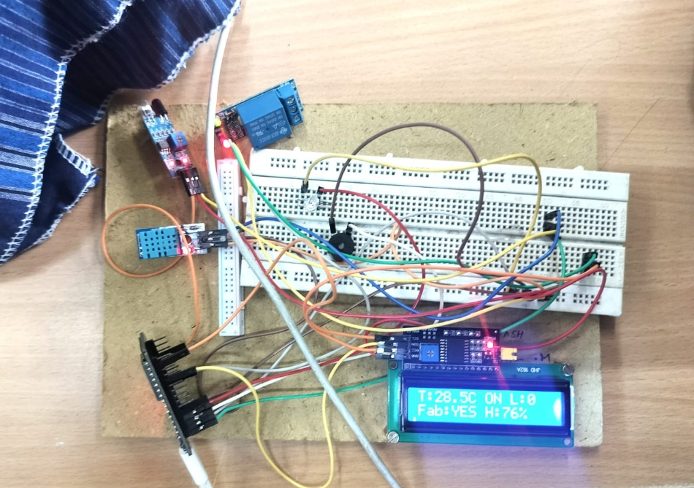

# AI-Assisted Smart Ironing System V4

> 🏆 **AI-Ignite Hackathon Project**
> *Built in 36 Hours | The First Agentic Hackathon*

[]

The **Smart Ironing System V4** is a next-generation industrial IoT solution designed to optimize fabric ironing processes through AI-driven fabric detection, real-time telemetry, and automated control.

## ⚡ Hardware Prototype



*The system prototype running on ESP32, integrating DHT11 sensors, Relay modules, and an LCD display.*

## 🚀 Key Features

*   **Hybrid Architecture**: Combines a robust Python AI Agent with a modern Next.js Dashboard.
*   **AI Fabric Detection**: Uses IR sensors and Machine Learning to identify fabric types (Cotton, Silk, Wool, etc.) and auto-adjust settings.
*   **Real-Time Telemetry**: Monitors temperature, humidity, and energy usage in real-time.
*   **Safety Automations**: Auto-shutoff on inactivity or overheating detection.
*   **Interactive Dashboard**: Control the system remotely, view historical trends, and train custom fabric models.

## 🏗 System Architecture

The project is structured into three main layers:

1.  **Frontend (Next.js)**: `app/` & `components/` - A responsive web interface for operators.
2.  **AI/Backend (Python)**: `scripts/` - Runs the decision engine, processes sensor data, and communicates with hardware.
3.  **Firmware (C/C++)**: `firmware/` - ESP32 firmware code (available for reference).

## 📂 Project Structure


```bash
├── app/                  # Next.js App Router (Frontend)
│   ├── layout.tsx        # Root layout for standard styling
│   └── page.tsx          # Main Dashboard UI aggregation
├── components/           # React UI Components
│   └── dashboard/        # Modular Dashboard Widgets
│       ├── DailySchedule.tsx
│       ├── ImpactReport.tsx
│       ├── StatusPanel.tsx
│       └── Dashboard.tsx
├── scripts/              # Python AI & Logic (Backend)
│   ├── iot_dashboard.py  # Main Entry Point (Streamlit Agent)
│   ├── decision_core.py  # AI Decision Logic (formerly smart_iron_agent.py)
│   ├── ai_engine.py      # ML Model Implementation
│   └── config.py         # System Configuration
├── public/               # Static Assets
│   └── hardware_setup.jpg # Prototype Image
└── firmware/             # ESP32 Microcontroller Code
```

## 🛠 Getting Started

### Prerequisites

*   Node.js 18+
*   Python 3.9+
*   ThingsBoard Account (for IoT data)

### Installation

1.  **Install Frontend Dependencies**:
    ```bash
    npm install
    ```

2.  **Install Backend Dependencies**:
    ```bash
    pip install -r requirements.txt
    ```

### Running the System

1.  **Start the Web Dashboard**:
    ```bash
    npm run dev
    ```
    Access at `http://localhost:3000`

2.  **Start the AI Agent**:
    ```bash
    streamlit run scripts/iot_dashboard.py
    ```

## 🔧 Configuration

Update `scripts/config.py` with your IoT credentials:

```python
TB_SERVER = "http://demo.thingsboard.io"
TB_TOKEN = "your_device_token"
```

## 👥 Team Members

*   **Abdul Saleem A**
*   **Aswin Dhayal**
*   **Dharani Kumar**
*   **Karthik Kishore**

## 📜 License

This project is licensed under the MIT License.
